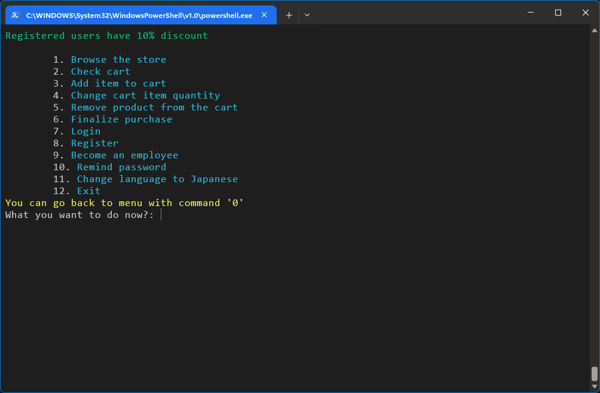

<h1 align="center">
  
  Konbini (Store simulator)
</h1>

<br>
<br>

<p align="center">
  
</p>

## Description
A console application written in modern C++, simulating a shop with various additional features/options.

#### Requirements

- Windows `11`
- MSVC `Visual Studio 2022`
- cmake `4.0 or newer`


## Launching

1. Download the project from github.
2. Go to project directory using terminal.
3. Create build folder and make cmake files.

```bash
mkdir build
cmake -S . -B build
```

4. Compile the project.

```bash
cmake --build ./build
```

5. Run project.

```bash
cd build/Debug
./konbini
## For tests:
./tests
```
For the best experience, run the system in a cleared, maximized terminal.

## Key System Features

* **Bilingual Product & UI System (EN/JP):** Full dual-language support with separate product databases and pricing per language (`ProductsLang::EN` / `ProductsLang::JP`), automatic currency switching (e.g., 円 for JP), and a dictionary-based (`std::unordered_map`) translation system loaded from external language files at runtime.
* **File-Backed Persistence:** Products and user accounts are stored in delimited text files and loaded into memory on startup. Updates (adding, editing, deleting) are written back using a safe temp-file-and-rename strategy to avoid data corruption during writes.
* **Account & Role Management:** Supports distinct user and admin account types, with account creation, login validation, password changes, and email updates, all synchronized between an in-memory `std::unordered_map` and the account file on disk.
* **Cart Logic with Dynamic Pricing:** Cart operations (add, remove, change quantity) automatically recalculate item and summary totals, including a 10% discount applied for logged-in users versus guests.
* **Inventory Synchronization:** Product quantities in the store are automatically adjusted when items are added to or removed from the cart, with logic to restore or reduce stock across both language databases simultaneously.
* **Modern C++ STL Usage:** Leverages `std::optional` for safe lookups (e.g., checking if a product exists), `std::string_view` for efficient string handling, and `std::ranges`/views (`std::views::keys`, `std::views::values`) for clean, allocation-light iteration over containers.
* **Colorful Console Output:** ANSI color codes are used to visually distinguish product names, prices, warnings, errors, and success messages in the console interface.## Technology Stack

## Technology Stack

* **Language:** C++23
* **Build System:** CMake
* **Unit Testing:** Google Test (GTest)
* **Development Environment:** Windows (CLion)

## Credits
Developed by **[cendyz](https://github.com/cendyz)**.